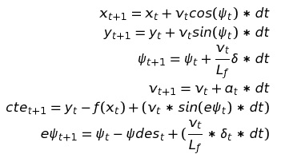

## MPC Controller

### The Model

**State**

To capture how the errors, change over the time, state vector of kinematic model is extended with those errors.

The updated state of the vehicle is `[x, y, ψ, v, cte, eψ]`

This includes car's position `(x, y)`, heading `(psi)`, velocity `(v)`, lateral distance error from the reference line `(cte)`, and heading error from the reference line `(epsi)`

**Actuators**

`[δ,a]` are the actuators, or control inputs to the system.

This includes steering angle (delta: +1 = 25 deg to left, -1 = 25 deg to right) and throttle/brake (a: +1 = full acceleration, -1 = full brake).

*Note: The simulator's steering control has the opposite direction (+1 = right, -1 = left), so the controller switches the sign of the steering values when sent/received from simulator*

**Model Equations**

The **motion model equations** are from the global kinematic model as provided by the Udacity lessons.

Note: [Equations from the Lesson 18](https://classroom.udacity.com/nanodegrees/nd013/parts/40f38239-66b6-46ec-ae68-03afd8a601c8/modules/f1820894-8322-4bb3-81aa-b26b3c6dcbaf/lessons/af4fcd4f-eb1f-43d8-82b3-17bb1e71695f/concepts/e88c2080-1abc-4800-a83c-83f52b2ca0c8) was used since equations presented in Lesson 19 were incorrect.

Where f(xt) is our reference line and ψdest can be calculated as the tangential angle of the polynomial f evaluated at xt, arctan(f′(xt)). f′ is the derivative of the polynomial.

**Lf** is a physical characteristic of the vehicle which measures the distance between the front of the vehicle and its center of gravity. It was left equal to 2.67 m as determined experimentally in the simulator by Udacity.

The code for these equations is contained in lines 157 through 164 of the file called MPC.cpp

This model covers the basic kinematics of the car movement, but it does not contain more comprehensive, but less practical, dynamic model.  This means that the predicted movement is only accurate for relatively small steering angles and stable conditions but on the other hand it can run in real time with far less effort.

### Timestep Length and Elapsed Duration (N & dt)

Using the motion model equations described above, the MPC controller plans a driving path over a fixed time horizon. We’ll refer to this as `T`. 
`T` is the product of two variables, `N` (the number of timesteps in the horizon) and `dt` (how much time elapses between actuations). 

To **tune the values of N & dt**, the following approach was used:

1. First a reasonable range for `T` is determined. In the case of driving a car, 1~2 second is a good range since we need sufficient horizon to account for things like upcoming turns on the path and at the same time beyond few seconds, the environment will change enough that it won't make sense to predict any further into the future 

2. Then `dt` is set to be in the range of expected control latency (so the model doesn't try to plan actuation faster than the car can actually deliver) but **small enough to keep a good precision** for the planned path.

3. Set the number of timesteps `N` to get the desired overall time horizon given `dt`, considering that as more timesteps are used, the latency delay from longer processing time will also become worse.

Initially, since the expected actuation latency was 100ms, I started with `N = 10` and `dt = 0.1` sec for a 1 sec overall time horizon, but this did not account for additional latency from the controller's processing time.  After using timestamps to measure the actual total latency of each control step, the total latency was closer to ~120ms so I added some margin by increasing dt and then could reduce N to keep a similar overall time horizon while also slightly reducing processing delay.

After tuning, the **final values** chosen are:

* N = 8
* dt = 0.15 sec

This results in an overall time horizon of 8 * 0.15 = 1.2 sec.

### Polynomial Fitting and MPC Preprocessing

At each control loop, the controller receives a set of the car's nearest 6 waypoint global coordinates from the simulator.  These waypoints need to be fitted with a 3rd order polynomial to be passed as the reference trajectory to the control block.

**Vehicle State**

However, because of the expected latency, the car will have continued to move for ~120ms from the time the waypoints were received before the control can be actuated. To compensate for this, vehicle is simulated starting from the current state for the duration of the latency using the vehicle model equations described in the previous [Model section](#the-model) above. The resulting state from the simulation is used as the new initial state for MPC.

The code for these equations is contained in lines 65 through 69 of the file called main.cpp

The latency amount is determined as a **moving average of the controller's measured total latency** calculated by timestamps to accurately account for differences in evaluation PC. Code for this calculation is available in lines 166 through 174 of main.cpp file.

**Waypoints**

After updating initial state of the vehicle, all the waypoints from global coordinate system were converted to vehicle's coordinate system at estimated position from above. This simplifies calculation of initial state of vehicle and also helps to fit a polynomial to reference trajectory more accurately.

The code for this preprocessing is contained in lines 71 through 78 of the file called main.cpp

**Actuator Input**

It should be also noted that since simulator's steering control has the opposite direction (+1 = right, -1 = left) it is multiplied by -1 before using on motion model. However, throttle input is used unmodified with model equations above. More accurate model would consider actual acceleration and deceleration ranges for corresponding actuator inputs. The corresponding scale factors may be obtained from either simulator source code or from manufacturer data in case of an actual vehicle. For the simplicity this was omitted and model is able to work with minor errors in model predictions due to this.

Finally, preprocessed waypoints were fit in to a 3rd order polynomial using `polyfit` helper function. Code for this is available in lines 80 through 86 of the file called main.cpp 

### Model Predictive Control with Latency

The MPC algorithm is implemented using two main components in `MPC.cpp`.

`vector<double> MPC::Solve(Eigen::VectorXd x0, Eigen::VectorXd coeffs)`

The bulk of this method is for setting up the vehicle model constraints (constraints) and variables (vars)

`void FG_eval::operator()(ADvector& fg, const ADvector& vars)`

This is where cost function and model constraints are defined. For smooth driving following terms of the cost function is tuned using appropriate scale factors.

1. **Basic cte** - to get car to follow the line.

2. **Basic epsi** - to keep car heading in the right direction but with heavier weighting looking farther down the road.

3. **Difference from target reference velocity** - to keep the car accelerating to the target speed.

4. **Difference from angle to end point of horizon** - to allow the car to cut the corners of the sharp turns a bit to improve the driving line and achieve higher speed.

5. **Absolute steering angle** - to encourage driving as straight as possible to achieve higher speed and stay within stable tire dynamics to keep the accuracy of latency estimation.

6. **Absolute throttle value** - for a lesser extent to minimize the usage of high acceleration/deceleration values. But this was neutered down using a very small-scale factor.

7. **Change in sequential steering actuations** - to smooth out changes in the steering.

8. **Change in sequential throttle (acceleration) actuations** - to smooth out changes in acceleration/braking.

These cost functions are defined in lines 59 through 98 of the file MPC.cpp

The model can compensate well for the expected 100ms actuator latency using the state estimation method described in the previous [MPC preprocessing section](#polynomial-fitting-and-mpc-preprocessing) above, but in order for the motion model equations to be accurate, the steering needs to stay within the region of stable tire dynamics that are not included in the equations.  For this, the cost term #5 for absolute steering angle is heavily weighted to keep steering angles as small as possible.

### Tuning Log

2019-01-24  
- `N=10, dt=0.1` state gains(cte, epsi, ref_v): `[2000, 2000, 1]` actuator rate gains(delta, a): `[5, 5]` actuator rate gains(delta', a'): `[200, 10]`  
No actuator delay `ref_v = 100mph` (94mph max)

2019-01-29
- `N=10, dt=0.15` state gains(cte, epsi, ref_v): `[20, 2000, 1]` actuator gains(delta, a): `[2000, 1]` actuator rate gains(delta', a'): `[200, 10]`  
No actuator delay `ref_v = 100mph` Fails to slow down at turns.

- `N=8, dt=0.15` state gains(cte, epsi, ref_v): `[2, 2000, 500]` dynamic ref_v factor for lateral movement: -0.25 actuator gains(delta, a): `[2000, 1]` actuator rate gains(delta', a'): `[200, 10]`  
No actuator delay `ref_v = 45m/s` (97mph max).

2019-02-19
- `N=8, dt=0.15` state gains(cte, epsi, ref_v, horizon_angle): `[2, 2000, 500, 5000]` dynamic ref_v factor for lateral movement: -0.25 actuator gains(delta, a): `[20000, 1]` actuator rate gains(delta', a'): `[20, 500]`  
No actuator delay `ref_v = 55m/s` (107mph max but reach curb).

2019-02-25
- `N=8, dt=0.15` state gains(cte, epsi, ref_v, horizon_angle): `[1, 5000, 500, 2000]` dynamic ref_v factor for lateral movement: -0.1 actuator gains(delta, a): `[2000, 1]` actuator rate gains(delta', a'): `[20, 500]`  
100ms actuator delay `ref_v = 55m/s` (110mph max).

---

### Simulation Result

Here is a [video of final tuned version of the controller](./videos/mpc_max_speed.mp4) reaching for speeds over 110mph.

The MPC controller is able to keep a **good driving line** with **smooth steering** and achieves a **peak speed of 110+ mph**!  It is also able to stay between 90-110 mph for each lap.

Note: To be on the safe side, project was submitted with max speed set to be under 100mph. You could try setting `double ref_v` value to something like 55 (m/s) if you feel adventurous. 